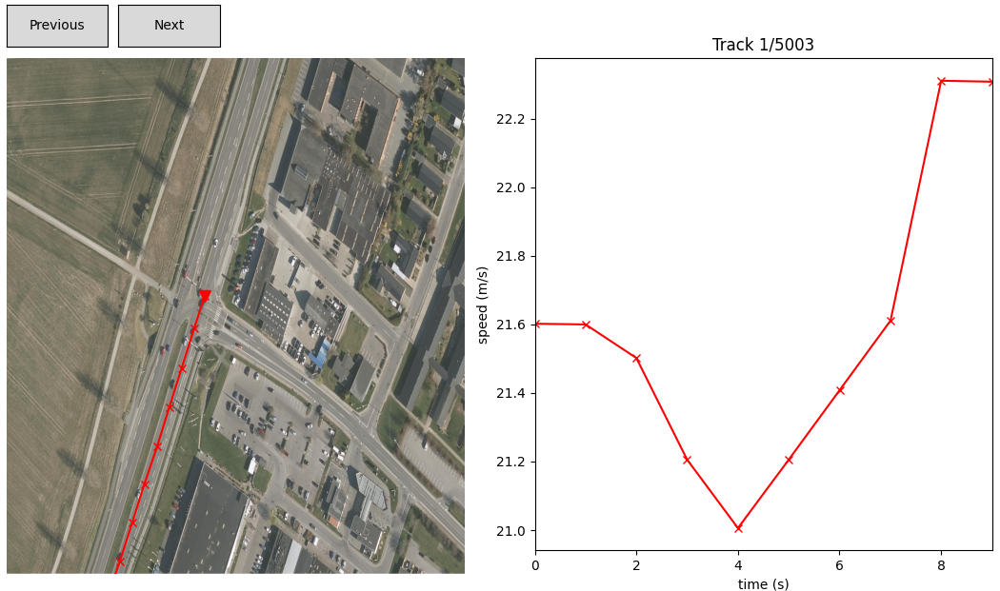

# Extraction and visualization of traffic radar data

## Installation and activation
Although `radarview` does not have many dependencies it is recommended to install package dependencies into a virtual environment, like `conda` or `virtualenv`:

```sh
# first time
conda create -n radarview python==3.8
conda activate radarview
pip install -e . # local install to the environment

# later times
conda activate radarview
```

## Raw SmartMicro radar data
Typical radar log consists of many thousands of rows of radar data. Each row represents a secondly radar response with `timestamp` with `raw` and `processed` data. `processed` data groups arriving vehiles into the directions `A` and `B` and corresponding maneuvers `A1LeftTurn`. Each key under processed contains `signal` for that maneuver a list of `objects` and corresponding aggregate data like `average_speed`, and `arrival_rate`.

```json
{
    "timestamp":1581328926868,
    "raw":[],
    "processed":{
        "psudo_a2h":{
            "signal_groups":["A2h"],
            "signal_change_time":null,
            "signal":"red",
            "sibling_lanes":[],
            "radar_range":200,
            "priority":{
                "car":1
                },
            "objects":[],
            "has_request_time":1581328926759,
            "has_request":true,
            "average_speed":1.4,
            "arrival_rate":1.0e-7
        },
        "psudo_BLeftTurn":{ //... 
        "b2cy":{ //...
        "aPed":{ //...
        "a2cy":{ //...
        "BLeftTurn":{ //...
        "B":{ //...
        "A2RightTurn":{ //...
        "A2Right":{ //...
        "A2Left":{ //...
        "A1Right":{ //...
        "A1LeftTurn":{ //...
        "A1Left":{ //...
    }
}
```
An example of `raw` data point describing an uncategorized detection originated from a `radar`. Those detections are used to extract tracks.

```json
{
    "timestamp":1567150095672,
    "raw": [
        {
            "y_speed":0.4000000000000057,
            "y_pos":-6.783999999999992,
            "x_speed":-22.0,
            "x_pos":226.43200000000002,
            "vehicle_class":"car",
            "radar":"A2, ttyS1",
            "priority":null,
            "length":4.4,
            "last_observed":null,
            "id":32,
            "eta":null,
            "distance_to_stop":null,
            "behind_stop_line":null
        },
        { // ...
        }
    ]
}
```

## Configuration
Each radar analysis is described with a configuration file.
```json
{
    "background_image": "data/havnevej/havnevej.png",
    "easting_range": [579153.163, 579515.159],    
    "northing_range": [6230351.462, 6230607.419],
    "dataset": "data/havnevej/data_0_to_50000",
    "radars": "data/havnevej/radars.json",
    "lanes": "data/havnevej/lanes.json",
    "tracks_output": "data/havnevej/output/",
    "center_roi": [
        [579303.4244864748, 6230463.5765769845],
        [579293.6363931869, 6230468.8153817635],
        [579281.5200641168, 6230475.3860860625],
        [579293.0662129953, 6230499.715450628],
        [579302.9968513312, 6230494.565439151],
        [579327.5621145831, 6230480.53609754],
        [579324.3786085137, 6230473.521426734],
        [579303.4244864748, 6230463.5765769845]]
}
```
## Extracting tracks
To extract the tracks use `extract_tracks.py` programas follows:

```sh
python extract_tracks.py -c config.json
```

Extracted tracks will be saved in `tracks.json` file at the path you have given. The file contains the `timestamps` that refer to position and velocity history `phistory`, `vhistory` in UTM coordinates and m/s respectively. Aggregate data such as track `length` and `idle_count`:

```json
{
    "id": "36_1",
    "missing": 3,
    "type": "car",
    "road": "A2",
    "radar": "A2, ttyS1",
    "length": 235.2878391971909,
    "idle_count": 0,
    "timestamps": [1581328973932, 1581328974931, 1581328975935, 1581328976939, 1581328977935, 1581328978955, 1581328979943, 1581328980942, 1581328981947, 1581328982951, 1581328983949, 1581328984958, 1581328985952, 1581328986954, 1581328987961, 1581328988966],
    "phistory": [
        [579183.0867267848, 6230264.545278134], [579194.2639655854, 6230280.810516305], [579204.6646339805, 6230297.654479288], [579216.2892441591, 6230313.670713745], [579226.7453119088, 6230329.824631141], [579236.2069310026, 6230346.165823389], [579245.307703537, 6230362.121895189], [579254.1594723566, 6230377.6305956105], [579262.9173427154, 6230392.312611642], [579271.4451978789, 6230406.976161224], [579279.139517079, 6230420.931720834], [579285.9628453451, 6230433.980400744], [579291.8835351453, 6230445.407359406], [579296.4848184978, 6230454.858601839], [579300.2267257936, 6230462.371060943], [579302.7726843636, 6230466.81364926]
        ],
    "vhistory": [
        [9.930315883556952, 17.018778641629268], [9.920426029775795, 16.79539065897983], [9.697038047126354, 16.805280512760984], [9.77452541564875, 16.53325899206919], [9.453870356914608, 16.36839440124325], [9.045838075876919, 16.25216334845965], [8.763926701403985, 15.951287997287817], [8.569392549234587, 15.601779108073625], [8.403712227545224, 14.892871475864107], [7.927266700902892, 14.242487235478082], [7.266176875872306, 13.465982088527317], [6.361919360629975, 12.252590830058818], [5.4766258220865485, 10.456412845945534], [4.358054447112521, 8.446736732963966], [3.7060387449996823, 6.864056877718974], [3.258447048837387, 5.85427389433762]
        ]
}
```

In addition a `metadata.json` sumarizing `tracks.json` will be extracted to the same path:
```json
{
    "tracks_per_category": {
        "car": 4
    },
    "tracks_per_lane": {
        "A2": 2,
        "A1": 2
    },
    "total_length_all_tracks": 911.7701833687929,
    "total_length_complete_tracks": 712.3959888464569,
    "percent_complete_tracks": 0.7813328422457383,
    "pass_by_count": 4,
    "mean_track_length": 178.09899721161423,
    "max_track_length": 184.663757631006,
    "min_track_length": 172.59259275539125,
    "std_track_length": 4.383605475176963
}
```

## Visualization
Visualizing tracks on top of an ortophoto and seeing their velocity profiles can be done as follows:
```sh
python visualize_tracks.py -c config.json -d data/havnevej/output/tracks.json
```

## Beyond example dataset
To request bigger dataset and tracks email mih.samusev@gmail.com. 